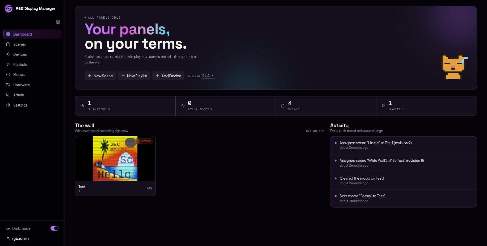
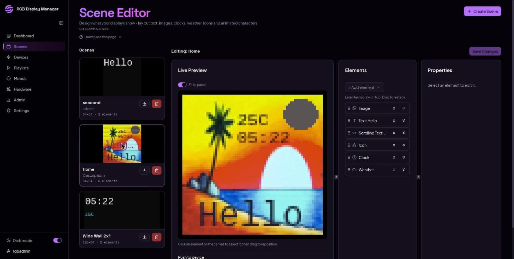
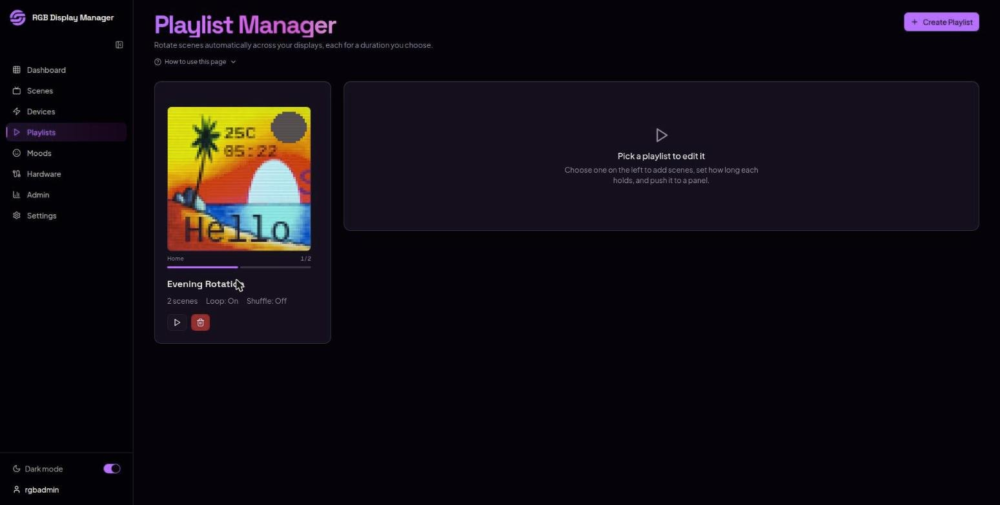
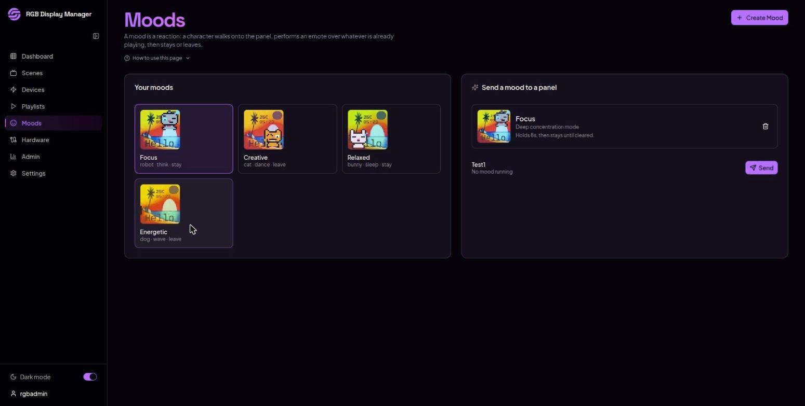
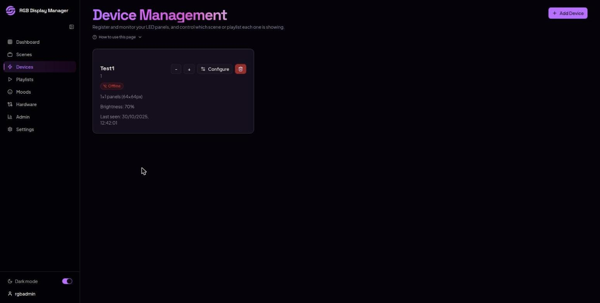
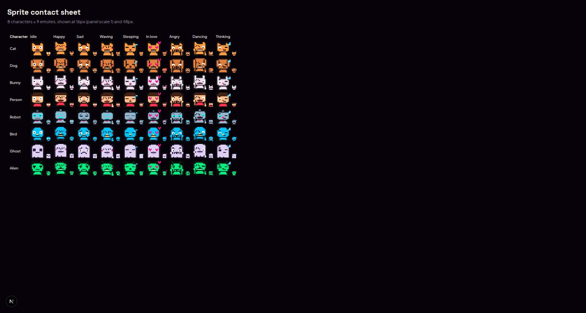

# RGB Display Manager

Design what your LED matrix wall shows from a browser, and let the panel run it
on its own.

Point it at an ESP32 driving a chain of HUB75 panels and you get a scene editor,
playlists, and animated characters - authored on the web, rendered on the
hardware. Once content is pushed, the website can be closed: the panel keeps the
time, fetches its own weather, animates locally, and rotates playlists on its
own timers.

| The wall, right now | Scene editor |
|:---:|:---:|
|  |  |
| **Dashboard** <br> <sub>Every panel and what it is showing, with the last push, mood and status change.</sub> | **Scenes** <br> <sub>Elements stacked on a pixel canvas, previewed at the panel's real size.</sub> |

| Playlists | Moods | Devices |
|:---:|:---:|:---:|
|  |  |  |
| **Playlists** <br> <sub>Rotate scenes, each for a duration, cached on the device.</sub> | **Moods** <br> <sub>A character walks on, performs an emote over what is playing, then stays or leaves.</sub> | **Devices** <br> <sub>Panel size, brightness and whether it has checked in.</sub> |

The sprite contact sheet at `/sprite-sheet` is rendered by the same sprite data
that generates the Arduino header, so it is the quickest way to see whether the
website and the firmware still agree:



There is a light theme as well; the same two screens are in
[`docs/screenshots/light/`](docs/screenshots/light).

## What it does

**Scenes.** A scene is a stack of elements on a pixel canvas - text, scrolling
text, images, a clock, live weather, icons, and animated pixel characters. Drag
to position, click on the canvas to edit, drag to restack (list order is
z-order). Every element can carry an animation: scroll, blink, pulse, rainbow or
bounce.

**Playlists.** Rotate several scenes, each for a duration you choose, with loop
and shuffle. The whole playlist is cached on the device, so the rotation is
local - nothing depends on the network staying up.

**Moods.** A mood is a *reaction*: a character walks onto the panel, performs an
emote over whatever is already playing, then stays or leaves. Eight characters
(cat, dog, bunny, person, robot, bird, ghost, alien) × nine emotes, with a
choice of entrance, corner, hold time and colour tint. Your content keeps
running underneath.

**Any wall shape.** Panels are 64×64 modules chained together. Pick an
arrangement - 1 panel, 2 side by side, 2×2, 3×3, up to 8 - and the editor,
previews and thumbnails all follow that shape.

**Devices.** Register each ESP32, set brightness and timezone from the web (no
reflash), watch online/offline status, and push a test pattern to work out which
physical panel is which.

## How the pieces fit

```
Browser  ──authors──>  Supabase (Postgres + Storage)
   │                        │
   │ assign/push            │ /api/device-feed/<token>
   ▼                        ▼
ThingSpeak  ──"something changed"──>  ESP32  ──renders──>  HUB75 wall
 (a revision number, nothing else)
```

ThingSpeak carries **only a revision counter**. When it changes, the ESP32
fetches the full scene or playlist from the web app in one request and caches
it. That split is deliberate: ThingSpeak's field size can't hold a scene, and
animation driven over a ~10s poll would look like a slideshow. So the website
authors and previews; the panel renders and animates.

The preview in the browser and the firmware run the *same* formulas - scroll
offsets, animation phases, mood entrance timing - implemented once as a written
spec and twice in code, with tests that fail if the two drift. What you design
is what plays.

## Repository layout

| Path | What's in it |
| --- | --- |
| `app/` | Next.js App Router - pages and the API routes the browser and the device call |
| `components/` | UI. The `*-complete.tsx` files are the live pages |
| `lib/` | Shared logic: scene schema, compositor, sprites, mood lifecycle, panel layouts |
| `Arduino_code/` | ESP32 firmware (PlatformIO). `README.md` there covers wiring, `SETUP.md` covers flashing |
| `scripts/` | SQL migrations, the sprite-header generator, and parity tests |

## Getting started

See **[DEVDOC.md](DEVDOC.md)** for requirements, setup, how to run it, and how
the code is organised.

For the hardware side - the 16-pin HUB75 connector, GPIO map, power and
chaining - see **[Arduino_code/README.md](Arduino_code/README.md)**. For
flashing and configuring the firmware, see
**[Arduino_code/SETUP.md](Arduino_code/SETUP.md)**.

## Running the checks

```bash
npm ci
npm run lint
npm run typecheck
npm test          # 257 tests, no network and no broker needed
npm run build
ops/hygiene.sh
```

CI runs all of it on push and pull request, plus an `npm audit --audit-level=high`.
That audit job exists because this repo carried a critical unauthenticated RCE
in Next (GHSA-p293-qw3h-jr36, GHSA-2xp9-vwfh-vxw4) with nothing watching for it.

## Running it without a backend

The app needs Supabase. Without it you get the sign-in screen and a clear 503
from the API rather than a stack trace, which is enough to check the UI builds
and renders:

```bash
NEXT_PUBLIC_SUPABASE_URL= NEXT_PUBLIC_SUPABASE_ANON_KEY= npm run dev
```

Use `http://localhost:3000`, not `127.0.0.1`: Next blocks its own dev assets
across origins, and the page comes up blank with the reason only in the server
log.

## License

MIT. See [LICENSE](LICENSE).
